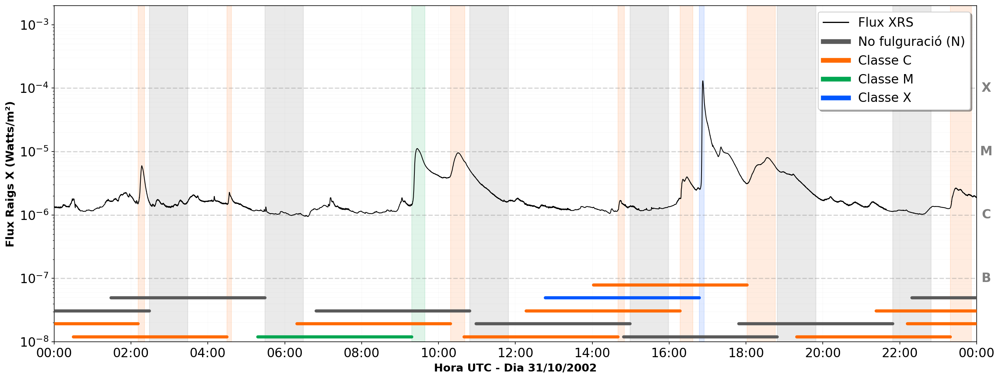

# Solar Flare Prediction using Deep Learning (Bachelor's Thesis)

> **Note:** The notebooks and internal documentation are written in **Spanish** and **Catalan**.

This repository contains the technical development of my Bachelor's Thesis (TFG), focused on using Deep Learning (Multi-Layer Perceptrons) to forecast solar flare events using data from the GOES mission.



## About this Project

I created this resource because I am passionate about sharing my knowledge and teaching others. This repository is designed to explain the experimental process of space weather forecasting—moving from raw satellite records to binary classification models. It serves as a comprehensive guide on how to handle imbalanced physical data and evaluate different training strategies.

## Methodology: Training Strategies

The core of this research compares two distinct approaches to handle the classification of solar activity:

### 1. Pre-Binary Strategy (`MLP_preBinary_1any.ipynb`)
In this approach, various solar flare intensity classes are grouped into a single positive class ("Yes") **before training**. The model is trained directly as a binary classifier to maximize the separation between flare events and non-events from the start.

### 2. Post-Binary Strategy (`MLP_postBinary_1any.ipynb`)
Here, the model is trained using **all original intensity classes** separately (Multi-class classification). Once the training is complete, the predictions are grouped into the "Yes" category to report binary performance metrics. This technique evaluates whether multi-class learning helps the model capture more subtle physical patterns before simplifying the output.

## Source Data
* **`1_any.txt`**: Raw flare records from the NOAA/GOES catalog during 2002, including timestamps and magnitude classifications used for labeling and time-window generation.

## Technologies Used
* **Python 3.x**
* **TensorFlow / Keras**: MLP architecture implementation.
* **Pandas**: Feature engineering and time-series preprocessing.
* **Matplotlib**: Visualization of learning curves and results.
* **Tqdm**: Progress management for large-scale data processing.

## Getting Started

1. Ensure `1_any.txt` is in the same directory as the notebooks.
2. Install the required dependencies:
```bash
pip install tensorflow pandas matplotlib tqdm requests
